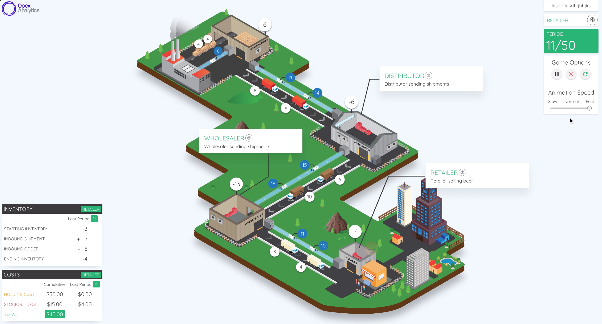

# Supply Chain Bot Tournament

Supply Chain Bot Tournament implemented as an OpenAI Gym environment. The core part of the game environment's implementation was forked from [this repository](https://github.com/orlov-ai/beer-game-env). 



## Installation

If you are struggling with any of the steps below, please reach out to us in the [official slack channel] (https://pydataglobal.slack.com/archives/C02HQ7G0QAJ):

1. You need a working Python installation of Python 3.8 or Python 3.9. If you are new to Python, we recommend to install Python and all dependencies via a Miniconda: https://docs.conda.io/en/latest/miniconda.html. You should then create a new conda environment. 
  
  ```
  conda create python=3.8 --name supply-chain-env
  conda activate supply-chain-env
  ```

3. Clone the repository, either with the command line or via your favorite git desktop client.

  ```
  git clone https://github.com/Supply-Chain-Bot-Tournament/supply-chain-tournament.git
  ```

4. Install the package

  ```
  cd supply-chain-tournament
  pip install -e .
  ```

5. Launch the `bot.py` file to run the game with randomly behaving agents. If everything was setup properly, you'll see a bunch of messaged printed to the standard output showing agents' actions and their outcomes.

  ```
  python bot.py
  ``` 

## Interpreting the ouput
Without (or after) making any changes to the agents, you should see 20 turns (can be thought of as days), when different data points at each agent are shown. It would be something like:

```
Turn #:  7
Stocks Levels (at the end of the turn):  -2, 18, 17, 19
Orders Placed:  [[0, 0], [2, 0], [2, 2], [2]]
Shipments Inbound:  [[0, 2], [1, 1], [0, 2], [2, 2]]
Next Incoming Orders:  [8, 0, 2, 2]
Cumulative holding cost:  [27.  42.  46.  47.5]
Cumulative stockout cost:  [2. 0. 0. 0.]
Last holding cost:  [0.  9.  8.5 9.5]
Last stockout cost:  [2. 0. 0. 0.]
```

* A turn number is shown at the top - this can be interpreted as the number of days it has been since the tournament started.
* The sequence is: retailer, wholesaler, distributor and manufacturer. So for `Stocks Levels (at the end of the turn)`, the stocks/inventory at the end of the turn  at the retailer is -1, at the wholesaler is 18, at the distributor is 17 and at the manufacturer is 19. A negative value signifies the number of units that got ordered but weren't available.
* `Stock Levels` - this is the stock or inventory level at each agent
* `Orders Placed` -  this is the amount of order placed during this turn by the agent, i.e., the AI bot made this decision. There are two values for each agent. It is assumed that the order information also takes 2 days to reach upstream, so these are the orders placed by the agents day before yesterday and yesterday, respectively.
* `Shipments Inbound` - these include the shipments which the agent placed earlier and are now expected to arrive in the near future. There are two values for each agent. "[[0, 2], [1, 1], [0, 3], [4, 1]]" would imply that no shipment is expected in 1 day at the retailer, a shipment of 2 units is expected at the retailer in 2 days, shipments of 1 unit each are expected at the wholesaler the next two days, no shipment is expected at the distributer in 1 day and a shipment of 3 units is expected at the distributer in 2 days, 4 new units are expected to be produced at the manufacturer in 1 day and 1 new unit is expected to be produced at the manufacturer in 2 days. Please note that these would match with the order placed the previous days.
* `Next Incoming Orders` - this is essentially the demand for each agent in the turn.
* Each agents will have to incur some costs to holding and maintaining the inventory - called `holding cost` and the opportunity cost of losing out of on potential sales because enough stocks were not available to fulfil the demand - called `stockout cost`. The cumulative costs so far at each agent for these two costs are also shown after each day/turn.

## Implementing Your Solution

Ideally, each agent will sell everything it got/produced every day - so zero holding costs and
will never disappoint a downstream agent, i.e., will never be out of stock and miss a sale - so
zero stockout costs, which is obviously only hypothetically possible. Your goal is to implement
an approach with which the costs are minimized overall across the supply chain.

In order to implement your solution, open the `bot.py` file and provide your implementation
for all given agents. You don't need to change anything except agents' classes. Also, please 
note that a valid agent's strategy cannot peek into the game's environment state or communicate 
internal state to other agents! (See the docstring at the very beginning of the file for 
additional details).  

To test your implementation, run the `bot.py` script again. The better your solution works, the
smaller should be the total cost reported at the end of the game.

Do NOT modify any other files. 

## Submitting to the Leaderboard

In order to participate in the tournament, you should follow these steps:
1. Once you're happy with the developed strategy, post your changes to a new branch in this repository  to trigger the evaluation and open a PR to merge to `main`
2. GitHub Actions will take care of evaluating your implementation and post your results to the leaderboard
3. Update your branch as often as you like, but be aware that the most recent results will be updated to the leaderboard, irrespectively of the result

Good luck and have fun!
